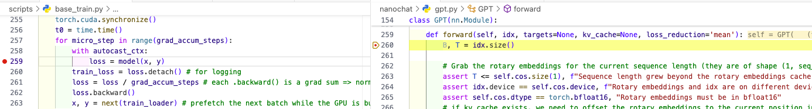

# 基础操作

(nanochat) double@CP-001:~/vsproject/nanochat$ pip install .
(nanochat) double@CP-001:~/vsproject/nanochat$ sudo snap install astral-uv --classic

# 注意点

- 注释: speenrun.sh 中的 # source .venv/bin/activate
- nproc_per_node=8 改成1
- model = torch.compile(model, dynamic=False) 
    + 注释掉可以debug GPT::forward
    + 注释会引发OOM (why?)，但可局部调试
    + 

